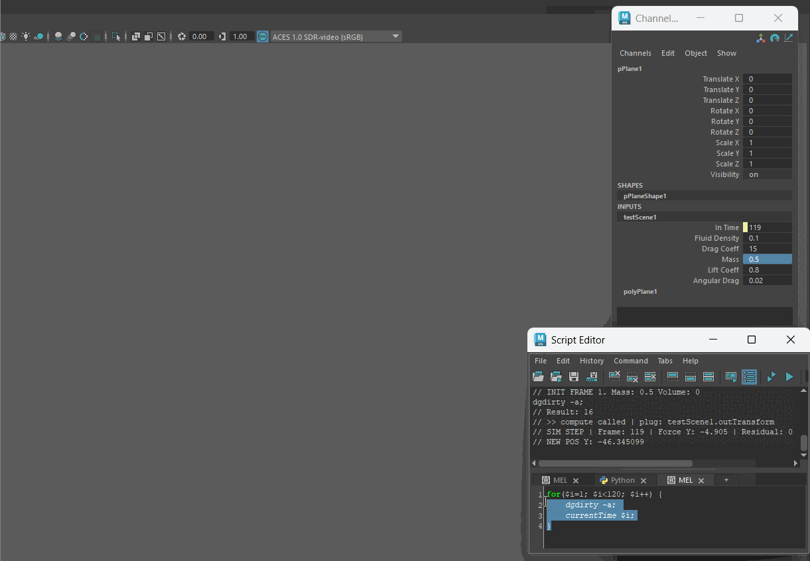

# FlowControl
University of Pennsylvania, CIS 6600: Advanced Computer Graphics Spring 2026, Final Project.

A project by Anya Agarwal and Caroline Fernandes.

## Introduction
Flow Control is a Maya Plugin recreating the SIGGRAPH paper [Going with the FLow](https://www.yousufsoliman.com/projects/going-with-the-flow.html) from 2024. In doing so we hope to create animations that are an approximation of fluid dynamics, we don't require costly volumetric calculations leading to an efficient and stable tool for animators.

## Alpha Milestone
For this milestone, we hoped to produce a scene of a plane falling similar to a leaf falling through the air. This included calculating the body intertia, the body momentum, external forces, and setting up the Newtonian Integrator.

## Beta Milestone
